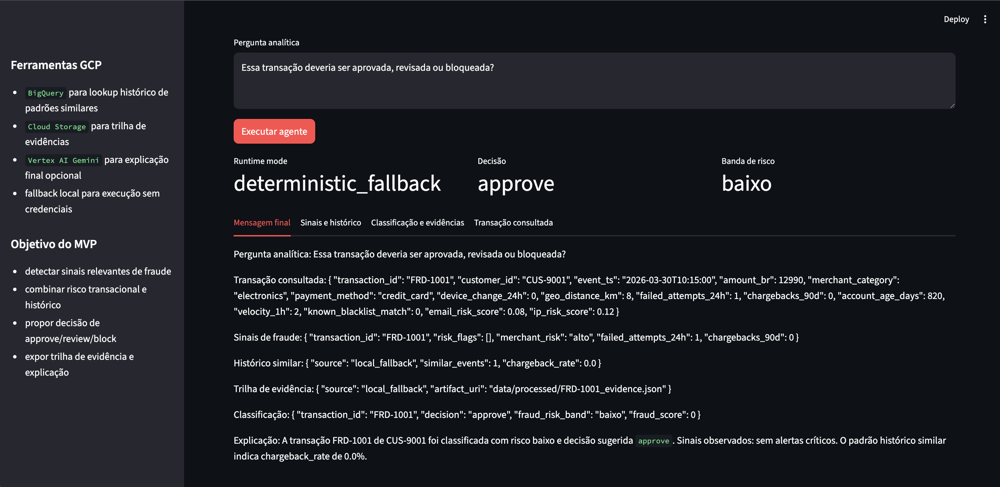
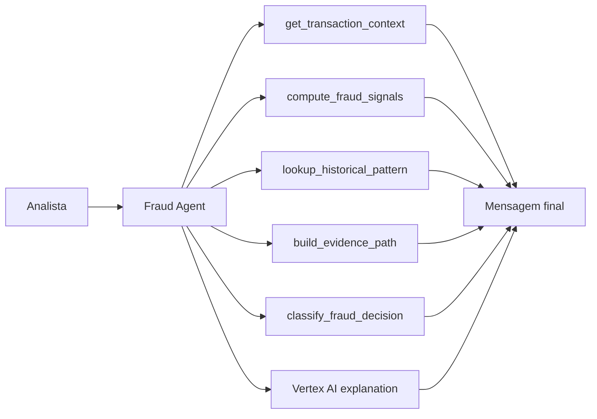

# Agente Prevencao Fraudes

Um MVP de agente de prevenção a fraudes usando ferramentas do `Google Cloud Platform`. O projeto foi desenhado para analisar transações, calcular sinais de fraude, consultar histórico similar, montar trilha de evidência e gerar uma decisão operacional de `approve`, `review` ou `block`.

## Visão Geral

O sistema responde perguntas como:

- essa transação deveria ser bloqueada?
- os sinais atuais justificam revisão manual?
- o histórico similar sugere risco de chargeback?
- onde a evidência dessa decisão deveria ser armazenada?

## Interface



## Arquitetura



## Ferramentas GCP no projeto

- `BigQuery`
  - para consulta histórica de padrões similares quando configurado;
- `Cloud Storage`
  - para montagem de trilha de evidência em `gs://...`;
- `Vertex AI Gemini`
  - para explicação final opcional quando credenciais estão disponíveis.

Quando o ambiente não tem configuração GCP, o projeto usa fallback local para manter a demo executável.

## Estrutura do Projeto

- [src/sample_data.py](/Users/flaviagaia/Documents/CV_FLAVIA_CODEX/agente_prevencao_fraudes/src/sample_data.py)
  - base demo de transações.
- [src/tools.py](/Users/flaviagaia/Documents/CV_FLAVIA_CODEX/agente_prevencao_fraudes/src/tools.py)
  - sinais, lookup, evidência e classificação.
- [src/agent.py](/Users/flaviagaia/Documents/CV_FLAVIA_CODEX/agente_prevencao_fraudes/src/agent.py)
  - orquestração com Vertex AI e fallback.
- [app.py](/Users/flaviagaia/Documents/CV_FLAVIA_CODEX/agente_prevencao_fraudes/app.py)
  - console técnico em `Streamlit`.
- [main.py](/Users/flaviagaia/Documents/CV_FLAVIA_CODEX/agente_prevencao_fraudes/main.py)
  - execução rápida e persistência do relatório.
- [tests/test_agent.py](/Users/flaviagaia/Documents/CV_FLAVIA_CODEX/agente_prevencao_fraudes/tests/test_agent.py)
  - validação principal.

## Métricas e sinais

O agente usa sinais como:

- distância geográfica anômala
- tentativas falhas recentes
- chargebacks históricos
- velocidade transacional
- mudança recente de dispositivo
- match em blacklist
- score de risco de e-mail
- score de risco de IP

## Contrato de Saída

`ask_fraud_prevention_agent()` retorna:

```json
{
  "runtime_mode": "gcp_vertex_agent | deterministic_fallback",
  "transaction_id": "FRD-1002",
  "transaction": {},
  "fraud_signals": {},
  "historical_pattern": {},
  "evidence_path": {},
  "classification": {},
  "decision_explanation": "texto",
  "final_message": "texto final"
}
```

## Execução Local

```bash
python3 main.py
python3 -m unittest discover -s tests -v
streamlit run app.py
```

## English Version

`Agente Prevencao Fraudes` is a fraud prevention MVP built around Google Cloud tools. It combines local fraud signal computation, historical pattern lookup, evidence trail generation, and optional Vertex AI explanation. When GCP credentials are not available, the project preserves the same output contract through a deterministic fallback.

## Interface


