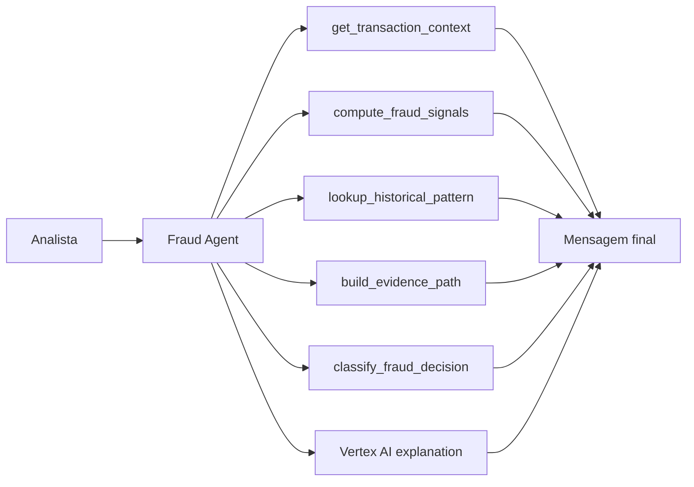

# Agente Prevencao Fraudes

Um MVP de agente de prevenção a fraudes usando ferramentas do `Google Cloud Platform`. O projeto foi desenhado para analisar transações, calcular sinais de fraude, consultar histórico similar, montar trilha de evidência e gerar uma decisão operacional de `approve`, `review` ou `block`.

## Visão Geral

O sistema responde perguntas como:

- essa transação deveria ser bloqueada?
- os sinais atuais justificam revisão manual?
- o histórico similar sugere risco de chargeback?
- onde a evidência dessa decisão deveria ser armazenada?

## Interface


## Arquitetura



## Ferramentas GCP no projeto

- `BigQuery`
  - para consulta histórica de padrões similares quando configurado;
- `Cloud Storage`
  - para montagem de trilha de evidência em `gs://...`;
- `Vertex AI Gemini`
  - para explicação final opcional quando credenciais estão disponíveis.

Quando o ambiente não tem configuração GCP, o projeto usa fallback local para manter a demo executável.

### Decisões de design

- `BigQuery`
  - modelado como camada de consulta histórica para comparar o evento atual com padrões similares de categoria e meio de pagamento;
- `Cloud Storage`
  - usado como abstração de trilha de evidência para armazenar ou referenciar artefatos de investigação;
- `Vertex AI Gemini`
  - posicionado como camada opcional de explicação final, nunca como fonte primária dos sinais de fraude;
- `deterministic_fallback`
  - preserva o contrato de saída e permite demonstração local mesmo sem credenciais GCP;
- `transaction grounding`
  - garante que a decisão parta sempre do evento consultado, dos sinais heurísticos e do histórico recuperado.

Esse desenho separa claramente:

- camada de evento transacional;
- camada de sinais de risco;
- camada de lookup histórico;
- camada de evidência;
- camada de explicação.

## Estrutura do Projeto

- [src/sample_data.py](src/sample_data.py)
  - base demo de transações.
- [src/tools.py](src/tools.py)
  - sinais, lookup, evidência e classificação.
- [src/agent.py](src/agent.py)
  - orquestração com Vertex AI e fallback.
- [app.py](app.py)
  - console técnico em `Streamlit`.
- [main.py](main.py)
  - execução rápida e persistência do relatório.
- [tests/test_agent.py](tests/test_agent.py)
  - validação principal.

## Topologia de Execução

O projeto foi estruturado em cinco camadas:

1. `transaction layer`
   - carrega o snapshot da transação;
2. `fraud signal layer`
   - calcula flags heurísticas como velocidade, anomalia geográfica e histórico de chargeback;
3. `historical enrichment layer`
   - consulta ou simula comparação com transações similares;
4. `evidence layer`
   - materializa uma referência de auditoria via `gs://...` ou caminho local;
5. `decision layer`
   - classifica a transação e consolida o racional final.

## Métricas e sinais

O agente usa sinais como:

- distância geográfica anômala
- tentativas falhas recentes
- chargebacks históricos
- velocidade transacional
- mudança recente de dispositivo
- match em blacklist
- score de risco de e-mail
- score de risco de IP

### Heurísticas principais

- `geo_distance_km >= 500`
  - sinaliza anomalia geográfica;
- `failed_attempts_24h >= 5`
  - sinaliza múltiplas tentativas falhas;
- `chargebacks_90d >= 1`
  - sinaliza histórico de chargeback;
- `velocity_1h >= 5`
  - sinaliza alta velocidade transacional;
- `device_change_24h == 1`
  - sinaliza mudança recente de dispositivo;
- `known_blacklist_match == 1`
  - sinaliza match em blacklist;
- `email_risk_score >= 0.7`
  - sinaliza alto risco no e-mail;
- `ip_risk_score >= 0.7`
  - sinaliza alto risco no IP.

### Score heurístico de decisão

Pontuação aplicada no MVP:

- `+3` para match em blacklist
- `+2` para anomalia geográfica
- `+2` para múltiplas tentativas falhas
- `+2` para histórico de chargeback
- `+1` para alta velocidade transacional
- `+1` para mudança recente de dispositivo
- `+1` para `chargeback_rate >= 30%` no histórico similar

Mapeamento do score:

- `score >= 7` -> `block` / `alto`
- `3 <= score < 7` -> `review` / `moderado`
- `score < 3` -> `approve` / `baixo`

### Papel de cada componente

- `compute_fraud_signals`
  - produz a leitura imediata do evento;
- `lookup_historical_pattern`
  - adiciona contexto histórico comparável;
- `build_evidence_path`
  - formaliza a trilha de auditoria;
- `classify_fraud_decision`
  - converte sinais em decisão operacional;
- `explain_fraud_decision`
  - traduz a decisão para um racional legível por analistas.

## Contrato de Saída

`ask_fraud_prevention_agent()` retorna:

```json
{
  "runtime_mode": "gcp_vertex_agent | deterministic_fallback",
  "transaction_id": "FRD-1002",
  "transaction": {},
  "fraud_signals": {},
  "historical_pattern": {},
  "evidence_path": {},
  "classification": {},
  "decision_explanation": "texto",
  "final_message": "texto final"
}
```

### Semântica do retorno

- `runtime_mode`
  - identifica se a resposta veio do `Vertex AI` ou do fallback local;
- `transaction`
  - snapshot canônico do evento sob análise;
- `fraud_signals`
  - camada heurística com flags observadas;
- `historical_pattern`
  - contexto comparável vindo de `BigQuery` ou fallback local;
- `evidence_path`
  - referência de armazenamento de evidência;
- `classification`
  - decisão e banda de risco;
- `decision_explanation`
  - racional executivo da decisão;
- `final_message`
  - resposta consolidada entregue ao analista.

Esse contrato único facilita integração futura com:

- filas de revisão manual;
- APIs internas;
- pipelines antifraude;
- trilhas de auditoria.

## Persistência e Artefatos

O script [main.py](main.py) gera o artefato:

- `data/processed/fraud_prevention_report.json`

Esse arquivo é produzido em runtime para auditoria local e não faz parte dos arquivos versionados do repositório.

## Execução Local

```bash
python3 main.py
python3 -m unittest discover -s tests -v
streamlit run app.py
```

## Interface Streamlit

O app funciona como um `inspection console` para:

- selecionar a transação;
- submeter uma pergunta analítica;
- inspecionar sinais, histórico e decisão;
- comparar a explicação com as evidências estruturadas.

Na prática, ele funciona como uma `debuggable presentation layer`, útil para:

- validar a coerência entre flags e classificação;
- evidenciar a origem das decisões;
- mostrar a camada GCP prevista no desenho;
- facilitar demonstração do fluxo para times técnicos e de risco.

## Validação

Os testes em [tests/test_agent.py](tests/test_agent.py) verificam:

- presença de flags em transações de alto risco;
- retorno de decisão válida;
- existência de mensagem final consolidada.

Além disso, o projeto foi validado com:

```bash
python3 main.py
python3 -m unittest discover -s tests -v
python3 -m py_compile app.py src/agent.py src/tools.py src/sample_data.py main.py
```

## English Version

`Agente Prevencao Fraudes` is a fraud prevention MVP built around Google Cloud tools. It combines local fraud signal computation, historical pattern lookup, evidence trail generation, and optional Vertex AI explanation. When GCP credentials are not available, the project preserves the same output contract through a deterministic fallback.

### Technical Highlights

- BigQuery-style historical lookup with local fallback
- Cloud Storage-style evidence path generation
- optional Vertex AI explanation layer
- deterministic fallback for local execution
- explicit fraud heuristics for geography, velocity, device change, and chargeback history
- Streamlit inspection console

## Interface


